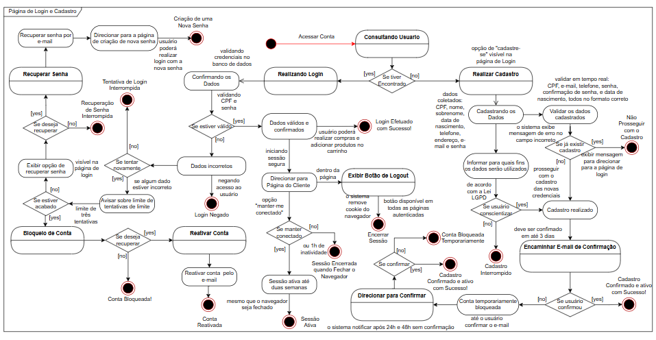
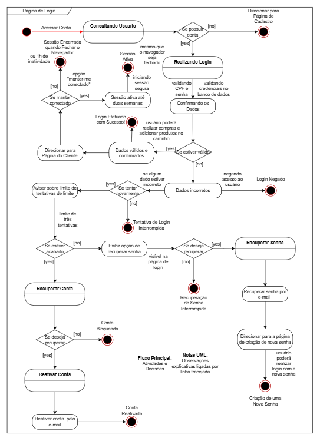

# Diagrama de Atividade Módulo Login

A Diagramação é uma parte muito importante para o desenvolvimento de uma aplicação, deixar de lado pode acarretar em erros técnicos futuros que poderiam ser previsto com a diagramação e modelagem de dados. 
A Linguagem de Modelagem Unificada (UML) é essencial para entender os fluxos, as entidades, os relacionamentos e a função de cada requisito. 

De acordo com a [IBM](https://www.ibm.com/docs/pt-br/rational-soft-arch/9.7.0?topic=diagrams-activity) "Um diagrama de atividade fornece uma visualização do comportamento de um sistema descrevendo a sequência de ações em um processo". 

Pode acompanhar o fluxo de login de forma separada. O usuário poderá acessar sua conta se os dados estiverem válidos, caso eles não estejam será preciso realizar novamente a tentativa de login. Com isso, alguns usuários poderão desistir de acessar sua conta, ou vão prosseguir com as tentativas, porém se o número de tentativas estiverem acabando o sistema vai notificar para o mesmo recuperar a sua senha, caso o mesmo prossiga com mais uma tentativa mesmo assim, a conta do usuário será bloqueada, e o mesmo só irá conseguir recuperar a sua conta atráves de seu e-mail. 

Obviamente que possuem fluxos complementares, como manter o usuário com dados válidos conectados por mais tempo, caso o mesmo deseje isso. Ou recuperar a senha por e-mail. 

Podemos visualizar que recuperar conta e recuperar senha são dois fluxos diferentes, por mais que seja o mesmo método feito para a recuperação. Isso acontece porque as telas são diferentes, e também os requisitos não funcionais como: segurança, confiabilidade, etc, podem ser diferentes. Por isso são fluxos diferentes. 

Sugiro que visualize essa imagem até entender todos os fluxos, é com o diagrama de atividade que a gente descobre a lógica do sistema. Alguma delas são: 

**Consultar usuário**, para verificar se o usuário já possui conta cadastrada no banco de dados. 

**Realizar Login**, aqui a lógica é clara, se possuir conta direcionar para a página do cliente, senão o mesmo deverá realizar o login novamente. 

**Recuperar Conta**, como o nome mesmo diz, se vai recuperar a conta é porque perdeu o acesso, ou a conta foi bloqueada, então é feito o processo de desbloqueio de conta e da reativação da conta. 

**Recuperar Senha**, quando o usuário não lembra a sua senha e deseja criar uma senha nova, ele é direcionado para a página de criação de nova senha. 

O objetivo desse fluxo é acesar conta, então todos os caminhos querem levar o usuário a acessar a sua conta. Os caminhos alternativos são quando o usuário desiste ou não prossegue com o fluxo, nestes casos são fluxos interrompidos. 

> Todas as notas soltas escritas nesse diagrama de atividade, são retiradas dos [requisitos de login do e-commerce](../../requisitos/requisitos_funcionais/login.md). Elas forma adicionadas para que as pessoas que desejam aprender sobre como transformar requisitos em diagramas ou modelagem de dados.  

Com esse diagrama de atividade, conseguimos criar a base dos modelos e da lógica do nosso projeto. Somente a base, porque conseguimos analisar algumas entidades presente nesse fluxo, mas ainda não conseguimos visualizar todas as entidades do sistema. Na modelagem de dados, com o [modelo conceitual](../../modelagem/conceitual/login.md) e [lógico](../../modelagem/logico/) é possível ter uma análise mais precisa sobre os modelos que devemos criar para o nosso projeto. 

Somente com esse diagrama de login conseguimos identificar que o sistema deve possuir um usuário, os dados que esses usuários devem possuir conseguimos analisar com mais precisão no nosso [requisito funcional do módulo de login](../../requisitos/requisitos_funcionais/login.md). 

Para a criação da [lógica de lógin do sistema](../../logica_sistema/ecommerce/login.md), onde é analisado se todos os fluxos estão sendo programados corretamente. Pode acessar o link azul para mais informações. 

